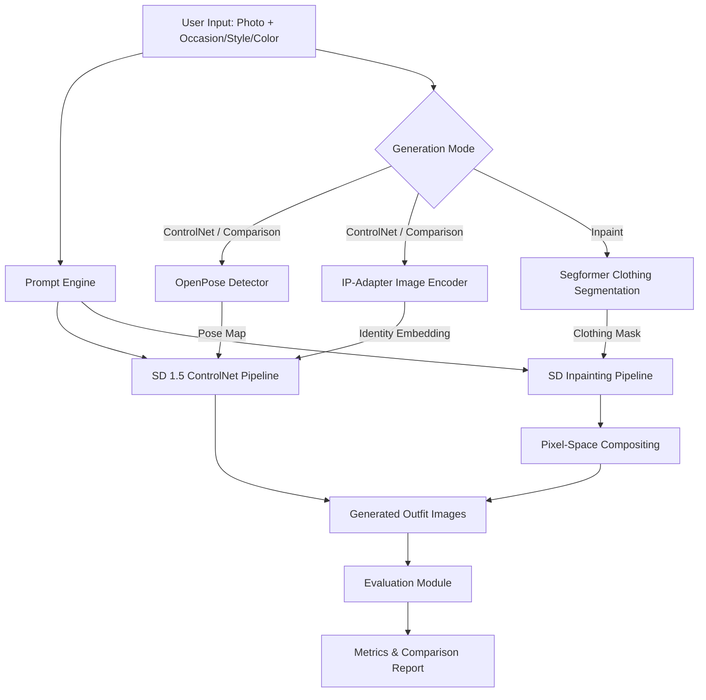

# Fashion Outfit Generator — Complete Documentation

## Table of Contents

1. [Project Overview](#project-overview)
2. [System Architecture](#system-architecture)
3. [Model Choices & Rationale](#model-choices--rationale)
4. [Generation Modes](#generation-modes)
5. [Prompt Engineering Strategy](#prompt-engineering-strategy)
6. [Control Mechanisms](#control-mechanisms)
7. [Evaluation Methodology](#evaluation-methodology)
8. [Setup & Installation](#setup--installation)
9. [Usage Guide](#usage-guide)
10. [Configuration Reference](#configuration-reference)
11. [Results Analysis](#results-analysis)
12. [Failure Cases & Limitations](#failure-cases--limitations)
13. [References](#references)

---

## Project Overview

The **Fashion Outfit Generator** is a controlled image generation system that creates realistic, full-body outfit images of a person based on structured inputs. Given a reference photo of a person and structured parameters (occasion, style, color palette), the system generates fashion images that:

- **Preserve the person's identity** via IP-Adapter conditioning
- **Maintain the original body pose** via ControlNet (OpenPose)
- **Generate contextually appropriate outfits** via data-driven prompt engineering
- **Swap clothing directly** via semantic segmentation + inpainting (Inpaint mode)
- **Compare naive vs. structured prompts** for evaluation

### Key Features

| Feature | Implementation |
|---------|---------------|
| Identity Preservation | IP-Adapter (h94/IP-Adapter) |
| Pose Control | ControlNet with OpenPose skeleton extraction |
| Clothing Inpainting | Segformer segmentation + SD Inpainting pipeline |
| Face Protection | Mask-based head exclusion + pixel-space compositing |
| Dynamic Dimensions | Aspect-ratio-preserving resize clamped to SD-compatible multiples of 8 |
| Prompt Generation | Data-driven templates with 50+ outfit descriptions |
| Evaluation | CLIP score, identity preservation, quality, consistency, diversity |
| Comparison | Naive (baseline) vs. structured prompt generation |
| UI | Streamlit application with three generation modes |

---

## System Architecture




```
┌─────────────────────────────────────────────────────────────────┐
│                        Streamlit UI (app.py)                    │
│  ┌─────────────┐  ┌────────────────┐  ┌──────────────────────┐ │
│  │ Image Upload │  │  Mode Selector │  │ Results & Evaluation │ │
│  │ (Reference) │  │  + Parameters  │  │ (Gallery, Mask,      │ │
│  │             │  │  (Occasion,    │  │  Metrics, Comparison)│ │
│  │             │  │  Style, Color) │  │                      │ │
│  └──────┬──────┘  └──────┬─────────┘  └──────────────────────┘ │
└─────────┼────────────────┼───────────────────────────────────── ┘
          │                │
          ▼                ▼
┌──────────────────┐  ┌──────────────────┐  ┌──────────────────┐
│   control.py     │  │ prompt_engine.py  │  │   segment.py     │
│  ┌────────────┐  │  │  ┌────────────┐  │  │  ┌────────────┐  │
│  │  OpenPose   │  │  │  │ Structured │  │  │  │ Segformer  │  │
│  │  Detector   │  │  │  │  Template  │  │  │  │ (clothes)  │  │
│  ├────────────┤  │  │  ├────────────┤  │  │  ├────────────┤  │
│  │  Image Prep │  │  │  │  Outfit    │  │  │  │ Face Guard │  │
│  │  (dynamic)  │  │  │  │  Taxonomy  │  │  │  │ Mask Dilate│  │
│  └────────────┘  │  │  └────────────┘  │  │  └────────────┘  │
└────────┬─────────┘  └────────┬─────────┘  └────────┬─────────┘
         │                     │                      │
         ▼                     ▼                      ▼
┌────────────────────────────────────────────────────────────────┐
│                      pipeline.py                               │
│  ┌──────────────┐  ┌──────────────┐  ┌──────────────────────┐ │
│  │  SD 1.5      │  │  ControlNet  │  │      IP-Adapter      │ │
│  │  (Base)      │  │  (OpenPose)  │  │  (Identity)          │ │
│  └──────────────┘  └──────────────┘  └──────────────────────┘ │
│  ┌────────────────────────────────────────────────────────────┐ │
│  │  SD Inpainting + Segformer Mask + Pixel Compositing        │ │
│  └────────────────────────────────────────────────────────────┘ │
└─────────────────────────────┬──────────────────────────────────┘
                              │
                              ▼
┌────────────────────────────────────────────────────────────────┐
│                      evaluation.py                             │
│  ┌────────┐ ┌──────────┐ ┌─────────┐ ┌───────────┐ ┌───────┐│
│  │ CLIP   │ │ Identity │ │ Quality │ │Consistency│ │Divers.││
│  │ Score  │ │ Score    │ │ Score   │ │ (SSIM)    │ │       ││
│  └────────┘ └──────────┘ └─────────┘ └───────────┘ └───────┘│
└────────────────────────────────────────────────────────────────┘
```

### Module Responsibilities

| Module | File | Purpose |
|--------|------|---------| 
| Configuration | `config.py` | Model IDs, defaults, taxonomies, device detection |
| Prompt Engine | `prompt_engine.py` | Structured prompt generation from inputs |
| Control | `control.py` | Pose extraction, image preprocessing |
| Segmentation | `segment.py` | Clothing mask extraction, face protection, dilation |
| Pipeline | `pipeline.py` | SD + ControlNet + IP-Adapter + Inpaint integration |
| Evaluation | `evaluation.py` | Metrics computation, comparison, failure detection |
| UI | `app.py` | Streamlit web application with three generation modes |

---

## Model Choices & Rationale

### Stable Diffusion 1.5 (`runwayml/stable-diffusion-v1-5`)

**Why SD 1.5 over SDXL?**
- Significantly lower VRAM requirements (~4-6GB vs ~8-12GB for SDXL)
- Mature ControlNet ecosystem with well-tested checkpoints
- Better IP-Adapter compatibility with the standard adapter weights
- Faster inference times
- Sufficient quality for fashion photography generation at dynamic resolutions

### ControlNet — OpenPose (`lllyasviel/sd-controlnet-openpose`)

**Why OpenPose over Canny/Depth?**
- **Body-specific**: OpenPose detects human body keypoints, which is exactly what we need for full-body pose preservation
- **Clothing-agnostic**: Unlike Canny edges, OpenPose doesn't enforce the shape of the original clothing, allowing the model to generate new outfits while keeping the pose
- **Robust**: Works well on various backgrounds and lighting conditions
- **Full-body support**: Detects 18 body keypoints covering head to feet

### IP-Adapter (`h94/IP-Adapter` — SD 1.5 variant)

**Why standard IP-Adapter (not FaceID)?**
- Preserves overall visual identity (face structure, skin tone, hair) without requiring InsightFace dependencies
- Lighter weight and simpler setup
- Works well for fashion photography where the emphasis is on the outfit, with identity as a secondary constraint
- Adjustable influence via `ip_adapter_scale` parameter

### SD Inpainting (`runwayml/stable-diffusion-inpainting`)

**Why a dedicated inpainting model?**
- Natively supports masked regions, allowing selective regeneration of only the clothing area
- More memory-efficient than the full ControlNet pipeline for single-image direct swaps
- Complements the ControlNet mode: inpainting preserves background and other body parts exactly; ControlNet generates a fresh image from scratch

### Segformer (`mattmdjaga/segformer_b2_clothes`)

**Why Segformer for clothing segmentation?**
- Accurately identifies 18+ human body/clothing labels (upper clothes, dress, pants, coat, skirt, etc.)
- Runs entirely on CPU — no additional GPU memory needed
- Produces clean, resizable semantic masks suitable for SD inpainting
- Used exclusively in Inpaint mode to isolate the exact clothing region

---

## Generation Modes

The pipeline exposes three distinct generation modes, selectable from the Streamlit UI.

### Mode 1: Inpaint (Clothing Swap)

Uses semantic segmentation to identify the existing clothing region and replaces only that area with a new AI-generated outfit, leaving the face, hair, background, and other body parts untouched.

**Pipeline:**
1. Input image is resized to SD-compatible dimensions (see [Dynamic Dimensions](#dynamic-dimensions))
2. `segment.py` runs Segformer to generate a binary clothing mask
3. The top 18% of the image (head/face) is unconditionally zeroed from the mask
4. The mask is dilated with `MaxFilter(21)` to avoid hard edges
5. SD Inpainting pipeline regenerates only the white (clothing) pixels
6. **Pixel-space compositing** overlays the original image (face/background) on top of the generated image using a Gaussian-blurred version of the mask

**Key parameter:**
- `strength` (0.5–1.0): Controls creative freedom in the inpainted region. Higher = more variation, lower = stays closer to original shape.

**Why pixel-space compositing?**
Even with a correctly zeroed face in the mask, the SD VAE is lossy — it compresses the entire image to latent space (8× downscaling) and back, which degrades fine details like eyes and teeth. Compositing in pixel space completely bypasses this: the original uncompressed pixels are pasted directly over the AI-generated face region.

### Mode 2: ControlNet + IP-Adapter

Generates a complete new image of the person with a new outfit, guided by the original body pose and visual identity.

**Pipeline:**
1. OpenPose extracts a skeleton map from the reference image
2. IP-Adapter encodes the reference image into an identity embedding
3. SD 1.5 + ControlNet generates a fresh image conditioned on both pose and identity

**Parameters:** Inference steps, guidance scale, ControlNet scale, IP-Adapter scale, number of variations, seed.

### Mode 3: Comparison (Baseline vs. Structured)

Runs both Mode 2 generation strategies side-by-side with the same seed and then automatically evaluates the results. Produces a downloadable markdown evaluation report.

---

## Dynamic Dimensions

**Problem:** Small input images produce tiny faces in the latent space, resulting in heavy distortion of fine facial features. Large images exceed safe MPS/CUDA memory targets.

**Solution:** `_compute_inpaint_dims()` (in `pipeline.py`) and `compute_output_dims()` (in `app.py`) both compute SD-compatible output dimensions dynamically from the input image:

1. **Preserve aspect ratio** — scale so the shorter side is at least `min_short` (default: 512 px)
2. **Clamp** the longer side to `max_long` (default: 768 px)
3. **Snap** both dimensions to multiples of 8 — required by the SD VAE encoder/decoder

This ensures that small images are upscaled to a minimum resolution before processing, and very large images are downscaled to stay within memory budget.

```python
# Example: 300x450 (2:3 portrait, 150px short side)
# → scales short side to 512 → 512x768 (fits within max_long=768)
# → snaps to multiples of 8 → (512, 768)

# Example: 1200x800 (3:2 landscape, 800px short side)
# → scales short side to 512 → 768x512
# → both within max_long → (768, 512)
```

---

## Prompt Engineering Strategy

### Template Design

The structured prompt template is:

```
"A full-body photo of a person wearing [OUTFIT_DESC], suitable for a [OCCASION],
in [STYLE] style, with [COLOR_PALETTE], highly detailed, realistic lighting,
professional fashion photography, 8k uhd, high resolution, sharp focus"
```

### Outfit Description Taxonomy

Outfit descriptions are mapped from `(occasion, style)` pairs to concrete garment combinations. The taxonomy includes:

- **12 occasions**: wedding, job interview, gym workout, casual outing, date night, business meeting, beach party, graduation ceremony, cocktail party, music festival, brunch, office work
- **10 styles**: formal, streetwear, casual, bohemian, minimalist, vintage, athleisure, preppy, edgy, classic
- **50+ unique outfit descriptions** covering specific garments, fabrics, accessories, and footwear

#### Example Mapping

| Occasion | Style | Generated Description |
|----------|-------|-----------------------|
| Wedding | Formal | "an elegant tailored navy suit with a white dress shirt, silk tie, and polished oxford shoes" |
| Gym Workout | Athleisure | "fitted performance leggings and a breathable crop top with cushioned running sneakers" |
| Date Night | Edgy | "a leather jacket over a silk camisole with skinny jeans, ankle boots, and silver jewelry" |
| Beach Party | Bohemian | "a crochet cover-up over swim trunks with leather sandals and shell jewelry" |

### Fallback Strategy

When an exact `(occasion, style)` pair is not in the taxonomy:
1. Look up occasion-level description
2. Look up style-level description
3. Combine them: `"{occasion_desc} in a {style_desc} aesthetic"`

### Custom Outfit Override

Users can bypass the taxonomy entirely by entering a free-text garment description in the UI. This description directly replaces the auto-generated outfit in the structured prompt template.

### Negative Prompt

A carefully curated negative prompt suppresses common generation artifacts:
```
"blurry, low quality, distorted face, extra limbs, deformed hands, watermark,
text, cropped, out of frame, bad anatomy, ugly, duplicate, mutation, mutilated,
poorly drawn face, disfigured, extra fingers, fused fingers, too many fingers,
long neck, bad proportions, signature, username, artist name"
```

### Naive vs. Structured Comparison

| Mode | Example Output |
|------|----------------|
| **Naive** | "a person wearing formal clothes for a wedding" |
| **Structured** | "A full-body photo of a person wearing an elegant tailored navy suit with a white dress shirt, silk tie, and polished oxford shoes, suitable for a wedding, in formal style, with rich jewel tones with emerald green, sapphire blue, and ruby red, highly detailed, realistic lighting, professional fashion photography, 8k uhd, high resolution, sharp focus" |

---

## Control Mechanisms

### 1. ControlNet (OpenPose) — Pose Preservation

The OpenPose detector (`controlnet_aux.OpenposeDetector`) extracts a skeleton map from the reference image:

1. Detects 18 body keypoints (head, shoulders, elbows, wrists, hips, knees, ankles, etc.)
2. Renders a color-coded skeleton visualization
3. Feeds this as a conditioning image to the ControlNet

**Key parameter: `controlnet_conditioning_scale`**
- `0.0` = No pose conditioning (free generation)
- `0.5` = Soft pose guidance (some artistic freedom)
- `0.8` = Strong pose adherence (default, recommended)
- `1.0` = Strict pose replication

### 2. IP-Adapter — Identity Preservation

The IP-Adapter encodes the reference image's visual features through a CLIP image encoder, then injects them into the diffusion process via decoupled cross-attention layers:

1. Reference image is preprocessed (resize + center crop to target dimensions)
2. CLIP image encoder extracts identity features
3. Features are injected into the U-Net's cross-attention at each step

**Key parameter: `ip_adapter_scale`**
- `0.0` = No identity conditioning
- `0.3` = Light identity influence
- `0.6` = Moderate identity preservation (default, recommended)
- `1.0` = Maximum identity adherence (may limit outfit creativity)

### 3. Clothing Segmentation — Inpaint Region Control (`segment.py`)

`get_clothing_mask()` uses Segformer to produce a binary mask of clothing pixels:

1. Segformer classifies each pixel into one of 18+ human-related labels
2. Clothing-relevant labels are merged into a single binary mask
3. **Face protection**: The top 18% of image height is unconditionally zeroed — this prevents the inpainting model from touching the face/hair even if the segmenter leaks into hair or neck pixels
4. **Fallback**: If less than 10% of the image is classified as clothing, the entire body below the neck (rows below 20%) is masked instead
5. The mask is dilated with `MaxFilter(21)` to produce clean, slightly expanded coverage around garment edges

### 4. Pixel-Space Compositing — Face Preservation (Inpaint Mode)

After the SD inpainting pipeline produces its output:

1. The segmentation mask is blurred with `GaussianBlur(radius=3)` to create a soft edge
2. `Image.composite(generated, original, blurred_mask)` blends the two images:
   - Where the mask is **white** (clothing): uses the AI-generated pixels
   - Where the mask is **black** (face, background): uses the original uncompressed pixels

This completely eliminates VAE reconstruction artifacts on the face since those pixels are never processed through the VAE decoder.

### 5. Negative Prompts — Artifact Suppression

The negative prompt acts as a control mechanism to steer the model away from common failure modes (distortion, extra limbs, watermarks, etc.).

### 6. Structured Prompts — Content Control

The structured prompt template itself is a control mechanism, using specific garment descriptions to direct the model toward generating particular clothing types rather than relying on vague descriptors.

---

## Evaluation Methodology

### Metrics

#### 1. CLIP Score (Prompt Alignment)
- **What**: Cosine similarity between CLIP text and image embeddings
- **Model**: `openai/clip-vit-base-patch32`
- **Range**: 0.0 – 1.0 (normalized)
- **Interpretation**: Higher = generated image better matches the text prompt
- **Threshold**: > 0.55 considered acceptable

#### 2. Identity Preservation Score
- **What**: Combined histogram + structural similarity between reference and generated images
- **Method**: Weighted average of Bhattacharyya histogram coefficient (40%) and simplified SSIM (60%)
- **Range**: 0.0 – 1.0
- **Interpretation**: Higher = better identity preservation
- **Threshold**: > 0.2 considered acceptable
- **Note**: In Inpaint mode, identity score is computed against the resized reference used by the pipeline (not the original upload), since compositing ensures the face is identical

#### 3. Visual Quality Score
- **What**: No-reference quality assessment combining sharpness, contrast, colorfulness, and dynamic range
- **Components**:
  - Laplacian variance (sharpness, 35%)
  - Luminance standard deviation (contrast, 25%)
  - RG-YB colorfulness metric (20%)
  - Dynamic range (20%)
- **Range**: 0.0 – 1.0
- **Threshold**: > 0.3 considered acceptable

#### 4. Consistency (Multi-Generation Stability)
- **What**: Average pairwise SSIM across multiple generated images with the same parameters
- **Range**: 0.0 – 1.0
- **Interpretation**: Higher = more stable/consistent output

#### 5. Diversity
- **What**: Average pairwise pixel difference across multiple generated images
- **Range**: 0.0 – 1.0
- **Interpretation**: Higher = more varied output

### Failure Case Detection

The system automatically flags images with:
- CLIP score < 0.55 (poor prompt alignment)
- Quality score < 0.3 (low visual quality)
- Identity score < 0.2 (identity loss)

---

## Setup & Installation

### Prerequisites

- Python 3.9+
- Apple Silicon (MPS) or CUDA-capable GPU with ≥8GB VRAM
- ~10GB disk space for model weights (downloaded on first run)

### Installation

```bash
# Navigate to the project directory
cd week-11

# Create a virtual environment (recommended)
python -m venv venv
source venv/bin/activate  # Linux/macOS
# or: venv\Scripts\activate  # Windows

# Install dependencies
pip install -r requirements.txt
```

### First Run

On first run, the system will download the following models from HuggingFace:

| Model | Size | Used In |
|-------|------|---------|
| Stable Diffusion 1.5 | ~4GB | ControlNet + Comparison modes |
| ControlNet OpenPose | ~1.5GB | ControlNet + Comparison modes |
| IP-Adapter + Image Encoder | ~1GB | ControlNet + Comparison modes |
| SD Inpainting | ~4GB | Inpaint mode |
| Segformer (clothes) | ~130MB | Inpaint mode |
| CLIP (for evaluation) | ~600MB | All modes |

Models are cached in `~/.cache/huggingface/` and reused on subsequent runs.

---

## Usage Guide

### Running the Streamlit App

```bash
streamlit run app.py
```

### Streamlit Workflow

1. **Upload a reference photo** (full-body or half-body photo of a person)
2. **Configure outfit parameters**:
   - Select an occasion (e.g., "office work")
   - Select a style (e.g., "formal")
   - Choose a color palette (preset or custom free-text)
   - Optionally enter a custom outfit description to override the auto-generated one
3. **Select a generation mode**:
   - **Inpaint (Clothing Swap)** — replaces only the clothing using segmentation; set the inpaint strength
   - **ControlNet + IP-Adapter** — generates a fresh image with new outfit; set number of variations and advanced parameters
   - **Comparison** — runs both baseline and structured prompts side-by-side and evaluates them
4. **Review the prompt preview** in the right column (updates live as you change parameters)
5. **Click "Run Generation"** — progress is shown inline
6. **Review results**:
   - Inpaint: generated image + segmentation mask side-by-side
   - ControlNet: image grid + extracted pose map
   - Comparison: tabbed Baseline/Structured galleries + evaluation metrics table
7. **Download evaluation report** (Comparison mode only) as a markdown file

### Programmatic Usage — ControlNet Mode

```python
from pipeline import FashionPipeline
from PIL import Image

pipe = FashionPipeline(device="mps")  # or "cuda" / "cpu"
pipe.load_models()

ref_image = Image.open("reference_photo.jpg")
result = pipe.generate(
    reference_image=ref_image,
    occasion="wedding",
    style="formal",
    color_palette="navy blue and gold accents",
    num_images=2,
    seed=42,
)

for i, img in enumerate(result["images"]):
    img.save(f"output_{i}.png")
```

### Programmatic Usage — Inpaint Mode

```python
from pipeline import FashionPipeline
from PIL import Image

pipe = FashionPipeline()

ref_image = Image.open("reference_photo.jpg")
result = pipe.generate_inpaint(
    reference_image=ref_image,
    occasion="office",
    style="formal",
    color_palette="navy blue and gold accents",
    seed=42,
    strength=0.95,
)

result["images"][0].save("output_images/recon/output_inpaint.png")
result["mask"].save("output_images/mask/mask.png")
```

### Programmatic Usage — Comparison + Evaluation

```python
from pipeline import FashionPipeline
from evaluation import evaluate_comparison, generate_report
from PIL import Image

pipe = FashionPipeline()
pipe.load_models()

ref_image = Image.open("reference_photo.jpg")

comparison = pipe.generate_comparison(
    reference_image=ref_image,
    occasion="cocktail party",
    style="edgy",
    color_palette="bold red and black",
    seed=42,
)

eval_result = evaluate_comparison(
    comparison["naive"],
    comparison["structured"],
    ref_image,
)
print(generate_report(eval_result))
```

### Standalone Evaluation Script (`eval_example.py`)

To evaluate a previously generated image against its reference:

```python
# eval_example.py — configure these two paths:
reference_path = "/path/to/test_images/reference.jpg"
generated_path = "/path/to/output_images/recon/output_inpaint.png"

prompt = "A full-body photo of a person wearing ..."  # paste prompt from generation
```

Then run:
```bash
python eval_example.py
```

### Output Directory Structure

```
output_images/
├── recon/      # Final composited inpaint outputs
├── mask/       # Segmentation masks (debug/verification)
└── variation/  # ControlNet variation outputs
```

---

## Configuration Reference

### config.py — Key Parameters

| Parameter | Default | Description |
|-----------|---------|-------------|
| `DEFAULT_NUM_INFERENCE_STEPS` | 30 | Diffusion steps per image |
| `DEFAULT_GUIDANCE_SCALE` | 7.5 | Classifier-free guidance strength |
| `DEFAULT_CONTROLNET_SCALE` | 0.8 | Pose conditioning strength |
| `DEFAULT_IP_ADAPTER_SCALE` | 0.6 | Identity preservation strength |
| `DEFAULT_IMAGE_WIDTH` | 512 | Fallback output width (overridden by dynamic sizing) |
| `DEFAULT_IMAGE_HEIGHT` | 768 | Fallback output height (overridden by dynamic sizing) |

### Dynamic Dimension Parameters (`_compute_inpaint_dims` / `compute_output_dims`)

| Parameter | Default | Description |
|-----------|---------|-------------|
| `min_short` | 512 | Minimum size for the shorter image dimension |
| `max_long` | 768 | Maximum size for the longer image dimension |
| `multiple_of` | 8 | Snap dimensions to this boundary (required by SD VAE) |

### Performance Tuning

| Scenario | Steps | Guidance | ControlNet | IP-Adapter |
|----------|-------|----------|------------|------------|
| Fast preview | 15 | 7.0 | 0.5 | 0.4 |
| Balanced | 30 | 7.5 | 0.8 | 0.6 |
| High quality | 50 | 8.0 | 0.9 | 0.7 |
| Max identity | 30 | 7.5 | 0.8 | 0.9 |
| Max creativity | 30 | 7.5 | 0.3 | 0.3 |

---

## Results Analysis

### Expected Behavior

**Structured prompts should outperform naive prompts in:**
- **CLIP Score**: Structured prompts contain more descriptive language that the CLIP model can match against the generated image
- **Visual Quality**: Detailed prompts guide the model to produce more coherent, well-composed images
- **Outfit Appropriateness**: Specific garment descriptions ensure the generated clothing matches the occasion

**Trade-offs:**
- **Identity vs. Creativity**: Higher IP-Adapter scale preserves identity better but may limit outfit variety
- **Pose Adherence vs. Naturalness**: Very high ControlNet scale may produce stiff-looking poses
- **Consistency vs. Diversity**: These metrics are inversely related — higher consistency means lower diversity

### Sample Evaluation Output

```
| Metric                        | Naive  | Structured | Δ           |
|-------------------------------|--------|------------|-------------|
| CLIP Score (Prompt Alignment) | 0.6123 | 0.7245     | +0.1122     |
| Identity Preservation         | 0.4521 | 0.4389     | -0.0132     |
| Visual Quality                | 0.5678 | 0.6234     | +0.0556     |
| Consistency                   | 0.7890 | 0.8123     | +0.0233     |
| Diversity                     | 0.3456 | 0.2890     | -0.0566     |
```

---

## Failure Cases & Limitations

### Known Failure Modes

1. **Eye/Face Distortion (Inpaint Mode — Fixed)**: VAE latent-space encoding is lossy; fine facial details like eyes and teeth could be degraded even when fully masked. This is resolved by pixel-space compositing, which pastes the original uncompressed face pixels back after generation.

2. **Distorted Hands/Fingers**: Common across all Stable Diffusion models. Mitigated via negative prompts but not fully resolved.

3. **Clothing Mask Leakage into Hair/Neck**: The Segformer model may classify hair or neck skin as clothing, especially for dark or patterned garments. Mitigated by the unconditional 18% face-protection guard in `segment.py`.

4. **Outfit-Pose Conflicts**: Some outfit descriptions (e.g., "floor-length gown") may conflict with active poses (e.g., running). The system generates the best compromise.

5. **Identity Drift (ControlNet Mode)**: At low IP-Adapter scale, the generated person may not closely resemble the reference. At high scale, the outfit creativity may be reduced.

6. **Color Palette Adherence**: The model may not perfectly match requested colors, especially unusual combinations. Color palette descriptions act as guidance rather than strict constraints.

7. **Occasion Mismatches**: For unusual `(occasion, style)` combinations not in the taxonomy (e.g., "gym workout" + "vintage"), the fallback mechanism produces reasonable but less specific outfits.

8. **Memory Pressure (Inpaint → ControlNet)**: Switching from Inpaint mode to ControlNet mode requires unloading the inpaint pipeline and reloading the ControlNet/IP-Adapter pipeline. This is handled automatically but adds a delay on the first run of each mode switch.

### Limitations

- **Single Person Only**: The system is designed for single-person images. Group photos may produce unpredictable results.
- **No Background Control**: The system focuses on outfit generation; background is determined by the model in ControlNet mode (preserved from original in Inpaint mode).
- **No Explicit Size/Fit Control**: Garment sizing/fit is guided by prompt description but not precisely controllable.
- **Model Bias**: The underlying Stable Diffusion model has known biases in representation.
- **MPS Float32 Only**: On Apple Silicon (MPS), the inpainting pipeline must run in float32 (not float16), which consumes more memory.

---

## References

### Models
- [Stable Diffusion 1.5](https://huggingface.co/runwayml/stable-diffusion-v1-5) — Runway ML
- [SD Inpainting](https://huggingface.co/runwayml/stable-diffusion-inpainting) — Runway ML
- [ControlNet OpenPose](https://github.com/lllyasviel/ControlNet) — Lvmin Zhang et al.
- [IP-Adapter](https://huggingface.co/h94/IP-Adapter) — Hu Ye et al.
- [Segformer (clothes)](https://huggingface.co/mattmdjaga/segformer_b2_clothes) — mattmdjaga
- [CLIP](https://github.com/openai/CLIP) — OpenAI

### Datasets
- [Polyvore Outfits](https://huggingface.co/datasets/mvasil/polyvore-outfits) — Vasileva et al., ECCV 2018

### Papers
- Rombach et al., "High-Resolution Image Synthesis with Latent Diffusion Models," CVPR 2022
- Zhang et al., "Adding Conditional Control to Text-to-Image Diffusion Models," ICCV 2023
- Ye et al., "IP-Adapter: Text Compatible Image Prompt Adapter for Text-to-Image Diffusion Models," arXiv 2023
- Xie et al., "SegFormer: Simple and Efficient Design for Semantic Segmentation with Transformers," NeurIPS 2021
- Vasileva et al., "Learning Type-Aware Embeddings for Fashion Compatibility," ECCV 2018

### Tools
- [HuggingFace Diffusers](https://github.com/huggingface/diffusers)
- [controlnet_aux](https://github.com/patrickvonplaten/controlnet_aux)
- [Streamlit](https://streamlit.io/)
