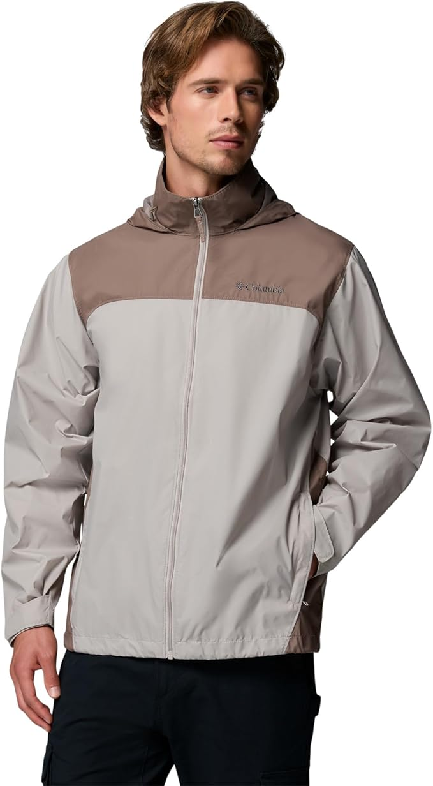
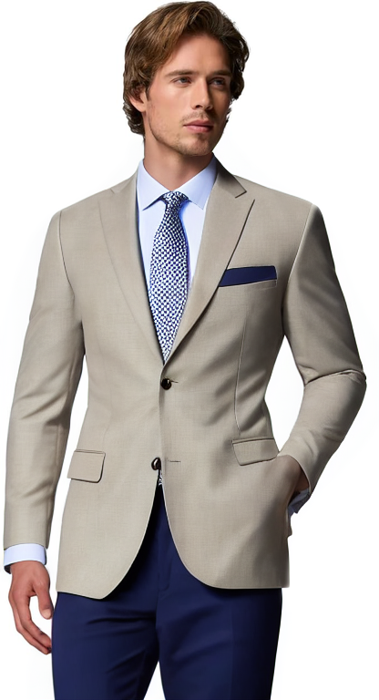

# Fashion Outfit Generator

The **Fashion Outfit Generator** is a controlled image generation system that creates realistic, full-body outfit images of a person based on structured inputs. Given a reference photo of a person and structured parameters (occasion, style, color palette), the system generates fashion images that:

- **Preserve the person's identity** via IP-Adapter conditioning.
- **Maintain the original body pose** via ControlNet (OpenPose).
- **Generate contextually appropriate outfits** via data-driven prompt engineering.
- **Swap clothing directly** via semantic segmentation + inpainting (Inpaint mode).
- **Compare naive vs. structured prompts** for robust evaluation.

For a full, in-depth dive into the system architecture, component rationale, limitations, and failure cases, please see [DOCUMENTATION.md](./DOCUMENTATION.md).

---

## Features

- **Identity Preservation**: Uses `h94/IP-Adapter` to maintain the user's face and visual identity.
- **Pose Control**: Uses `ControlNet` with OpenPose skeleton extraction to keep the exact original body posture.
- **Clothing Inpainting**: Uses `Segformer` segmentation and SD Inpainting pipeline for direct clothing replacements, avoiding background alteration.
- **Dynamic Dimensions**: Aspect-ratio-preserving resize clamped to SD-compatible multiples of 8.
- **Prompt Generation**: Data-driven templates with 50+ outfit descriptions for accurate generation.
- **Evaluation Metrics**: Computes CLIP score, identity preservation, quality, consistency, and diversity.

---

## Output Images Comparison: Naive vs. Structured

A core objective of this project is demonstrating how **Structured** prompts (generated programmatically) perform compared to **Naive** (baseline) prompts when generating fashion imagery.

| Mode | Example Prompt Output |
|------|-----------------------|
| **Naive** | "a person wearing formal clothes for a wedding" |
| **Structured** | "A full-body photo of a person wearing an elegant tailored navy suit with a white dress shirt, silk tie, and polished oxford shoes, suitable for a wedding, in formal style, with rich jewel tones with emerald green, sapphire blue, and ruby red, highly detailed, realistic lighting, professional fashion photography, 8k uhd, high resolution, sharp focus" |

### Performance Differences

Structured prompts consistently outperform naive prompts by providing the generation pipeline with explicit garment definitions and style constraints:
- **CLIP Score**: Structured prompts contain more descriptive language that the CLIP model can successfully match against the generated image.
- **Visual Quality**: Detailed prompts guide the model to produce more coherent, well-composed images without structural confusion.
- **Outfit Appropriateness**: Specific garment descriptions ensure the generated clothing actually matches the requested occasion.

### Sample Evaluation Metrics

Below is a sample run showing the quantitative improvements across key metrics:

```text
| Metric                        | Naive  | Structured | Δ           |
|-------------------------------|--------|------------|-------------|
| CLIP Score (Prompt Alignment) | 0.6123 | 0.7245     | +0.1122     |
| Identity Preservation         | 0.4521 | 0.4389     | -0.0132     |
| Visual Quality                | 0.5678 | 0.6234     | +0.0556     |
| Consistency                   | 0.7890 | 0.8123     | +0.0233     |
| Diversity                     | 0.3456 | 0.2890     | -0.0566     |
```

*(Note: Identity Preservation can sometimes see a slight dip with structured prompts because the model changes the garments and overall scene more heavily, whereas naive prompts tend to stick closer to the reference image context at the expense of ignoring the outfit requirements).*

### Reconstruction Evaluation (Inpaint Mode)

Here is an evaluation of the clothing swap capability (Inpaint Mode) using a Ground Truth (GT) and its reconstructed output:

**GT Image:**  


**Reconstructed Image:**  


| Metric | Score |
|--------|-------|
| CLIP Score (Prompt Alignment) | 0.6417 |
| Identity Preservation Score | 0.8612 |
| Visual Quality Score | 0.8489 |
| SSIM Score | 0.7973 |

---

## Setup & Installation

### Prerequisites
- Python 3.9+
- Apple Silicon (MPS) or CUDA-capable GPU with ≥8GB VRAM
- ~10GB disk space for model weights (downloaded automatically on first run)

### Installation

1. Navigate to the project directory:
   ```bash
   cd week-13
   ```
2. Create a virtual environment (recommended):
   ```bash
   python -m venv venv
   source venv/bin/activate  # Linux/macOS
   # or: venv\Scripts\activate  # Windows
   ```
3. Install dependencies:
   ```bash
   pip install -r requirements.txt
   ```

---

## Usage Guide

### Running the Streamlit App

The easiest way to interact with the system is via the included Streamlit application, which offers a full UI for generation, parameter tuning, and evaluation.

```bash
streamlit run app.py
```

### Generation Modes
1. **Inpaint (Clothing Swap)**: Uses Segformer to identify the existing clothing region and replaces only that area with a new AI-generated outfit, leaving the face, hair, and background untouched.
2. **ControlNet + IP-Adapter**: Generates a completely new image of the person with a new outfit, guided by the original body pose (OpenPose) and visual identity (IP-Adapter).
3. **Comparison (Baseline vs. Structured)**: Runs both Mode 2 generation strategies side-by-side using the same seed and automatically evaluates the results. Produces a downloadable markdown evaluation report.

For programmatic usage, standalone evaluation script instructions, and detailed configuration parameters, refer to the [DOCUMENTATION.md](./DOCUMENTATION.md).